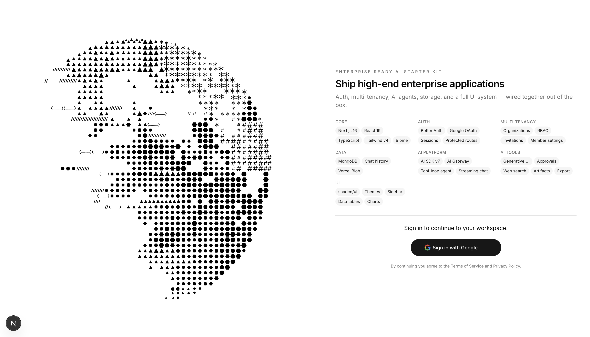
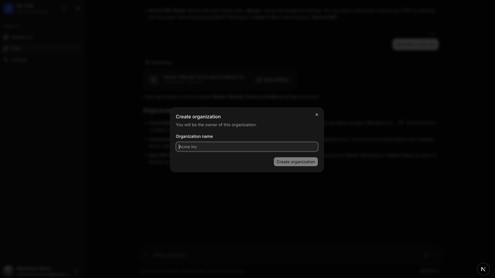
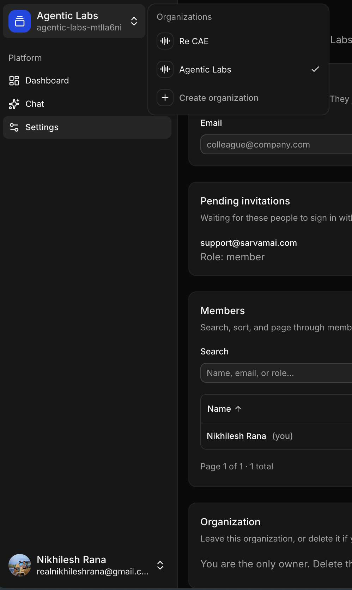
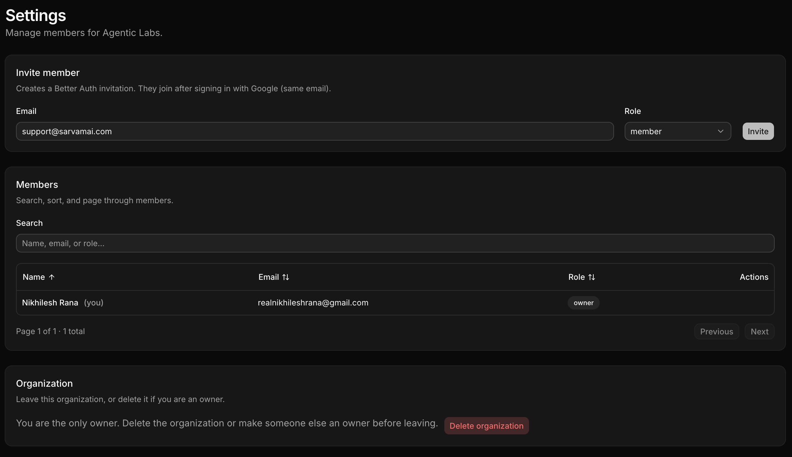
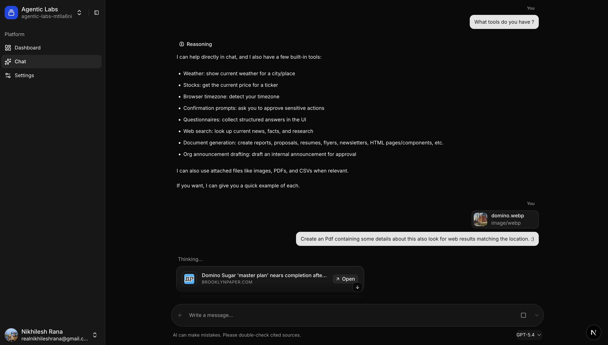
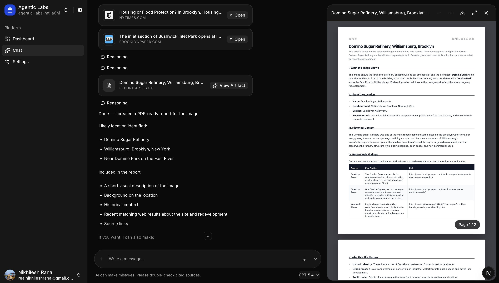

# Enterprise Ready AI Starter Kit

A production-ready **Next.js starter kit** for building **enterprise-grade AI applications** — multi-tenant auth, organization management, AI agents, file storage, and a full shadcn/ui design system in one repo.

Ship faster with auth, RBAC, streaming chat, tool-calling agents, and a polished UI already wired together.


## Overview

Landing page with Google sign-in and a full module overview — everything included in the kit at a glance.



## What's included

### Application core

| Module | Purpose |
|--------|---------|
| **Next.js 16** | App Router, Server Components, Cache Components |
| **React 19** | Latest React with Compiler support |
| **TypeScript** | End-to-end type safety |
| **Tailwind CSS v4** | Utility-first styling with CSS variables |
| **Biome** | Fast linting and formatting |

### Authentication

| Module | Purpose |
|--------|---------|
| **Better Auth** | Cookie-based sessions, MongoDB adapter |
| **Google OAuth** | Social sign-in |
| **Protected routes** | Optimistic middleware gate + server session validation |
| **Rate limiting** | Database-backed request limits |

### Multi-tenancy

| Module | Purpose |
|--------|---------|
| **Organizations** | Create, switch, and manage workspaces |
| **RBAC** | Owner, admin, and member roles with permission helpers |
| **Invitations** | Invite teammates to an organization |
| **Member settings** | Sortable data table, role updates, org deletion |

Create a workspace on first sign-in. New users are prompted to name their organization before entering the app.



Switch between organizations from the sidebar. Create additional workspaces without leaving the dashboard.



Invite members by email, assign roles, search and paginate the member table, and manage org lifecycle (leave / delete).



### Data & storage

| Module | Purpose |
|--------|---------|
| **MongoDB** | Primary database via official driver |
| **Chat history** | Persist and restore AI conversations |
| **Vercel Blob** | Client and server file uploads |

### AI platform

| Module | Purpose |
|--------|---------|
| **Vercel AI Gateway** | Unified routing to Claude, GPT, Gemini, DeepSeek, and more |
| **AI SDK v7** | Streaming, tool calling, agent loops |
| **Tool-loop agent** | Multi-step agent with 12-step cap and reasoning |
| **Chat UI** | Attachments, model picker, history, artifact panel |

Streaming chat with tool calls, file attachments, model picker, and chat history — powered by the tool-loop agent and Vercel AI Gateway.



### AI capabilities

| Module | Purpose |
|--------|---------|
| **Generative UI tools** | Weather, stock, and search result cards |
| **Human-in-the-loop** | User confirmations, questionnaires, approval gates |
| **Perplexity search** | Live web search via AI Gateway |
| **Document artifacts** | HTML reports, proposals, and code artifacts |
| **File attachments** | JPEG, PNG, GIF, WebP, PDF, CSV in chat |
| **Export** | PDF and PNG export for generated artifacts |

Generated documents open in a side artifact panel with live PDF preview, zoom, and export — built from image + web search + `createDocument` tool output.



### UI system

| Module | Purpose |
|--------|---------|
| **shadcn/ui** | 60+ accessible components (Base UI + Mira style) |
| **Themes** | Dark / light via `next-themes` |
| **Layout** | Collapsible sidebar, mobile top bar and bottom nav |
| **Data tables** | TanStack Table with sorting and pagination |
| **Charts** | Recharts integration |
| **Chat primitives** | Message scroller, bubbles, attachments, markers |

## Project structure

```
src/
├── app/
│   ├── page.tsx                 # Landing + Google sign-in
│   ├── protected/
│   │   ├── dashboard/           # Authenticated home
│   │   ├── chat/                # AI chat workspace
│   │   └── settings/            # Members & organization settings (page.tsx)
│   └── api/
│       ├── auth/[...all]/       # Better Auth handler
│       ├── chat/                # AI streaming + history
│       └── blob/                # Vercel Blob uploads
├── components/
│   ├── ai/                      # Chat, artifacts, tool cards
│   └── ui/                      # shadcn/ui components
└── lib/
    ├── auth/                    # Server + client auth, permissions
    ├── ai/                      # Agent, tools, models, gateway
    ├── db/                      # MongoDB + chat persistence
    └── blob/                    # Blob path helpers + client upload
```

## Getting started

### Prerequisites

- [Bun](https://bun.sh) 1.4+ (or Node.js 20+)
- MongoDB database
- Google OAuth credentials
- Vercel AI Gateway key (or linked Vercel project with OIDC)

### Environment variables

Create a `.env.local` file:

```bash
# Database
MONGODB_URI=
DB_NAME=
NEXT_PUBLIC_DB_NAME=          # must match DB_NAME

# Auth
BETTER_AUTH_SECRET=
BETTER_AUTH_URL=http://localhost:3000
GOOGLE_CLIENT_ID=
GOOGLE_CLIENT_SECRET=

# AI (Vercel AI Gateway)
AI_GATEWAY_API_KEY=             # or VERCEL_OIDC_TOKEN via `vercel env pull`
AI_GATEWAY_MODEL=openai/gpt-5.4 # optional default model

# Optional
TOOL_APPROVAL_SECRET=           # defaults to BETTER_AUTH_SECRET
```

### Install & run

```bash
bun install
bun dev
```

Open [http://localhost:3000](http://localhost:3000).

Verify auth is wired correctly:

```bash
curl http://localhost:3000/api/auth/ok
# → {"status":"ok"}
```

### MongoDB on Vercel (Atlas)

This project follows the documented patterns for **Better Auth + MongoDB + Vercel Fluid Compute**:

| Concern | Approach |
|---------|----------|
| Adapter | `mongodbAdapter(db, { client })` with shared `MongoClient` ([docs](https://www.better-auth.com/docs/adapters/mongo)) |
| Connection pooling | `attachDatabasePool(client)` ([Vercel docs](https://vercel.com/docs/functions/functions-api-reference/vercel-functions-package#attachdatabasepool)) |
| Cold starts | `ensureDbReady()` connects with retry before auth/DB routes run |
| Indexes | Idempotent `createIndex` in background via `after()` ([performance guide](https://www.better-auth.com/docs/guides/optimizing-for-performance)) |
| Joins | `advanced.database.joins: true` for faster session/org queries |
| Rate limits | `rateLimit.storage: "database"` (not in-memory) for serverless |
| Protected routes | Cookie check in `proxy.ts`, full `getSession` in layout ([Next.js integration](https://www.better-auth.com/docs/integrations/next)) |

**Atlas checklist** (fixes `ReplicaSetNoPrimary` / timeout on first login):

1. Use the **`mongodb+srv://`** connection string from Atlas
2. **Network Access** → allow your IP or `0.0.0.0/0` for Vercel
3. Confirm the cluster is **not paused** (M0 free tier sleeps after inactivity)
4. Deploy region close to your Atlas cluster region

### Scripts

| Command | Description |
|---------|-------------|
| `bun dev` | Start development server |
| `bun build` | Production build |
| `bun start` | Start production server |
| `bun lint` | Run Biome checks |
| `bun format` | Format with Biome |

## Routes

| Route | Description |
|-------|-------------|
| `/` | Landing page with module overview and Google sign-in |
| `/protected/dashboard` | Authenticated dashboard |
| `/protected/chat` | AI chat with tools, artifacts, and history |
| `/protected/settings` | Organization members, invitations, and roles |

## Deploy on Vercel

1. Push the repo to GitHub.
2. Import the project in [Vercel](https://vercel.com/new).
3. Add environment variables (or run `vercel env pull`).
4. Deploy — Fluid Compute runs API routes and the AI chat endpoint.

See [Next.js deployment docs](https://nextjs.org/docs/app/building-your-application/deploying) for details.

## Author

**Developed by [Nikhilesh Rana](https://github.com/Nikhileshrana)**

Built to help developers ship enterprise-grade AI applications faster — without rebuilding auth, multi-tenancy, and agent infrastructure from scratch every time.

- GitHub: [@Nikhileshrana](https://github.com/Nikhileshrana)
- Repository: [Nikhileshrana/Starter-Kit](https://github.com/Nikhileshrana/Starter-Kit)

Questions, feedback, and contributions are welcome. If this starter kit saves you time, consider starring the repo so more developers can find it.

## License

Private — see repository owner for usage terms.
